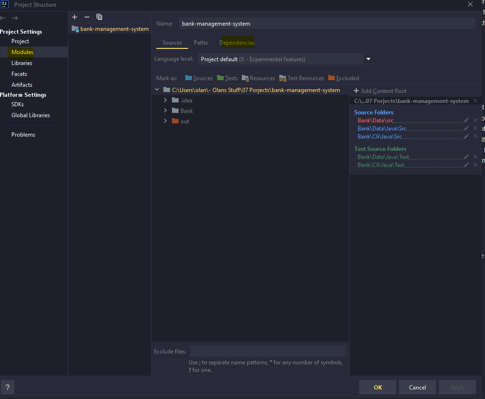
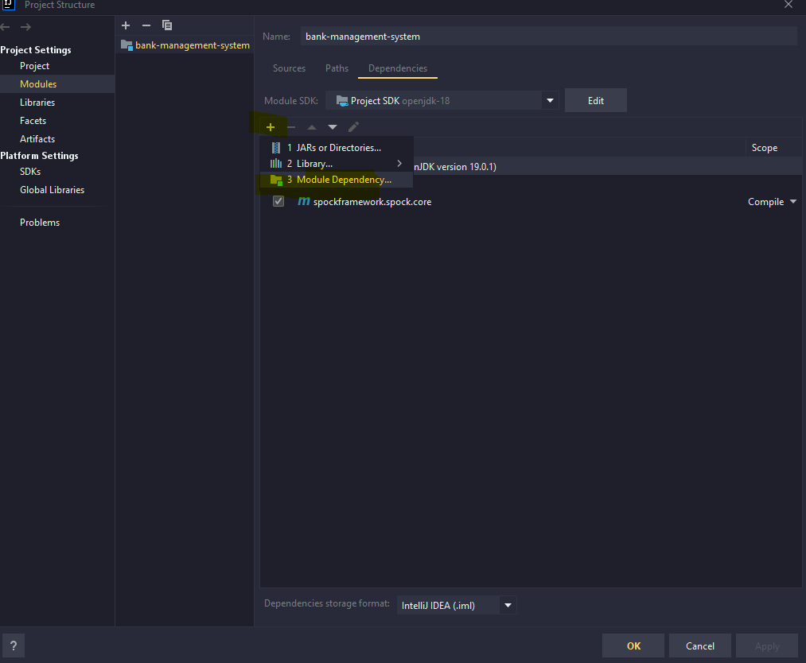

# Bank Management System

## Table of Contents

1. [**December 10th, 2023**](#december-10th-2023)
2. [**December 11th, 2023**](#december-11th-2023)
3. [**December 12th, 2023**](#december-12th-2023)
    - [**Setting up Groovy**](#setting-up-groovy)
4. [**December 13th, 2023**](#december-13th-2023)
5. [**December 14th, 2023**](#december-14th-2023)

## December 10th, 2023

### Introducing Bank Transactions Classes

Today, I added the  `Bank` and `Transactions`. The `Bank` class  is just getters and setters for user id, password, while `Transactions` conducts the typical financial operations - viewing balances, making deposits, orchestrating withdrawals, and completing transfers.
Plan to potentially add more such as giving each user a uniquely generated code (like an IBAN) which will subsequently replace how transfers are done

## December 11th, 2023

### Added Data Class to handle csv's

Added the `Data` class, to manage CSV. Not using massive database so CSV's are satisfactory as a means for storing account details. One thing that's not happening at the moment is if a transaction (any type) is made which changes
the balance in any way it is not being done. 

## December 12th, 2023

### Groovy Framework added

So in college we used JUnit for testing but I think it sucks. In work, we use groovy so I wanted to use groovy too. Added in the spock framework for this to take place and wrote `TransactionsSpec` test class.
Will do the rest of the core classes tomor hopefully. Testing wise, I plan in the future to incorpate CICD using jenkins with integration testing

### Setting Up Groovy

So it was fairly easy to setup groovy

 **Pre reqs**

- Use intelleji

1. Right click on root project folder and down the bottom click `Open Module Settings`
2. On the Left side, click Dependencies then click dependencies 
3. once here, click the `+` button, then  `add dependency` . A  search field should show so search for `org.spockframework:spock-core` and click whichever version you want 
4. Then press apply changes and you will be able to make groovy test in a root `test` folder

## December 13th, 2023

### Restructuring + finishing off `TransactionSpec`

So I ran into some issues with dependencies the way my files were structured so I completed restructured them. I over did what I was trying and led to everything fecking up. Now I have all my code/testing scripts
within src. I also packaged the code and it has allowed my scripts to run perfectly. I still am a bit unsure with my pom file if it is running correctly as when I run 
~~~
mvn clean install
~~~
It's saying build succesful but dont think I am pointing in the right directon.

I want to look at having a jenkins pipeline so it could automatically run my tests.

I also started the starts if the 'cli', with `BankInterface` & `InterfaceSetup`. I plan on making all obects nd stuff in the 
interface setup class and then the interface is where I'll run the code from

## December 14th, 2023

### Working more on startup of `BankInterface`

So today I pretty much just spent adding in the make account function for cli. It works and essentially calls a method in `BankInterfaceSetup`. I am going to use this so I dont have to have a load of shitty
objects in my main and all the object creation and deletion will be done here. I would like to use more java features such as inheritance. abstract classes and stuff so that is something to look at.
I also realised that 
~~~
mvn clean install
~~~
is working as intended. It is using the target and getting the test class from there. I also want to look at making a jenkins pipeline as mentioned and now that I Know this is working I am confident in doing so
